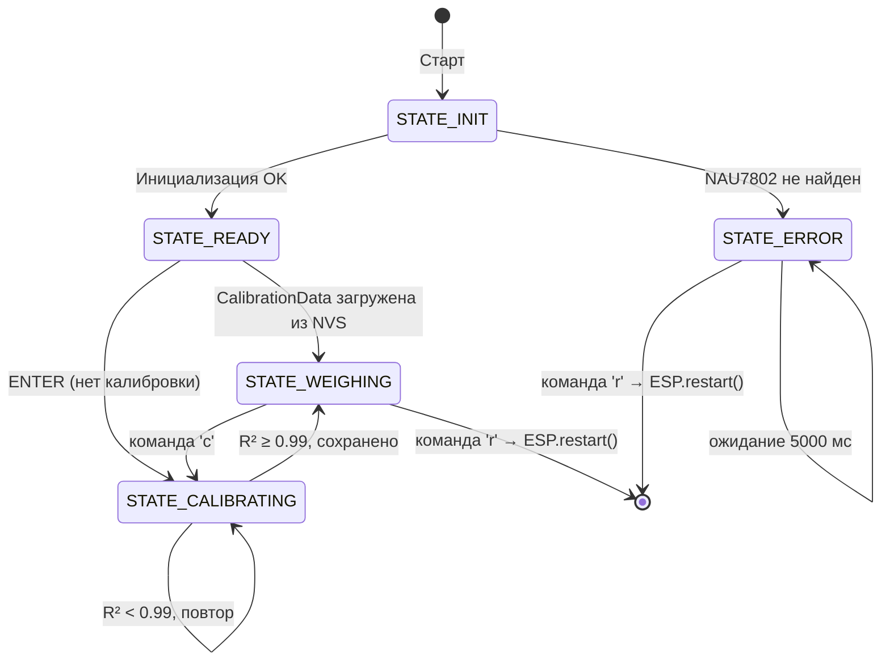

# Технический дизайн: ESP-32 NAU7802 Scale

## Обзор

Прошивка тестера весов реализует встроенную систему на базе ESP-32 DevKit с 24-битным АЦП NAU7802 и тензодатчиком 50 г (half-bridge). Система обеспечивает:

- Автоматическую инициализацию I2C и NAU7802 при старте
- 4-точечную интерактивную калибровку с линейной регрессией МНК и валидацией R² > 0.99
- Непрерывное взвешивание на частоте 10 Гц с SMA-10 фильтрацией
- Сохранение калибровочных коэффициентов в энергонезависимой памяти NVS (Preferences.h)
- UART-консоль (115200 baud) с тегированным выводом и командами управления

Платформа: PlatformIO, Arduino framework, C++. Библиотека: SparkFun NAU7802 Scale ≥ 1.2.5.

---

## Архитектура

Система построена на конечном автомате (FSM) с пятью состояниями. Каждый модуль отвечает за одну зону ответственности и взаимодействует через общие структуры данных из `calibration_data.h`.



### Поток данных

```
NAU7802 (I2C 0x2A, 400 кГц)
    │
    ▼ getReading() → int32_t rawADC
scale_weighing.cpp
    │ computeWeight(k, b, rawADC) → float calibrated
    ▼
SMA_Filter (кольцевой буфер 10 значений) → float filtered
    │
    ▼
ui_console.cpp → UART "[WEIGH] Raw: ... | Calibrated: ...g | Filtered: ...g"
```

---

## Компоненты и интерфейсы

### main.cpp — FSM и главный цикл

Содержит перечисление `AppState`, глобальный экземпляр `SparkFun_NAU7802 myScale` и `CalibrationData calibration`. Реализует `setup()`, `loop()` и диспетчер команд `handleCommand(char cmd)`.

```cpp
enum AppState {
    STATE_INIT,
    STATE_READY,
    STATE_CALIBRATING,
    STATE_WEIGHING,
    STATE_ERROR
};
```

Переходы состояний обрабатываются в `loop()` через `switch(currentState)`. Команды читаются из `Serial` в начале каждой итерации.

---

### scale_init.h / scale_init.cpp

```cpp
// Инициализирует Wire (GPIO 21/22, 400 кГц) и NAU7802.
// Возвращает true при успехе, false при ошибке обнаружения.
bool initHardware(SparkFun_NAU7802& scale);
```

Внутри: `Wire.begin(21, 22)`, `Wire.setClock(400000)`, `scale.begin(Wire)`, `scale.setGain(NAU7802_GAIN_128)`, `scale.setSampleRate(NAU7802_SPS_320)`, `scale.enableChopper()`.

---

### scale_calibration.h / scale_calibration.cpp

```cpp
// Запускает интерактивный 4-шаговый мастер калибровки.
// Заполняет cal.points[], вычисляет k, b, r2 через math_utils.
// Возвращает true если R² ≥ 0.99.
bool runCalibrationWizard(SparkFun_NAU7802& scale, CalibrationData& cal);

// Собирает numSamples отсчётов с интервалом 100 мс, возвращает среднее.
int32_t collectSamples(SparkFun_NAU7802& scale, int numSamples);
```

Целевые веса: `{0.0f, 10.0f, 20.0f, 30.0f}` г. На каждой точке: ожидание ENTER → сбор 50 отсчётов → вычисление среднего rawADC → сохранение CalibrationPoint.

---

### scale_weighing.h / scale_weighing.cpp

```cpp
// Вычисляет вес по линейной модели.
float computeWeight(float k, float b, int32_t rawADC);

// Класс SMA-фильтра с кольцевым буфером.
class SMA_Filter {
public:
    void    add(float value);
    float   getAverage() const;
private:
    static const int BUFFER_SIZE = 10;
    float   _buf[BUFFER_SIZE];
    int     _idx;
    int     _count;
};

// Один цикл взвешивания (вызывается из loop()).
// Читает rawADC, вычисляет calibrated и filtered, выводит в консоль.
void weighingTick(SparkFun_NAU7802& scale,
                  const CalibrationData& cal,
                  SMA_Filter& filter);
```

---

### calibration_storage.h / calibration_storage.cpp

```cpp
// Сохраняет CalibrationData в NVS (namespace "scale_cal").
void saveCalibration(const CalibrationData& cal);

// Загружает CalibrationData из NVS.
// Возвращает false если k == 0.0 (калибровка отсутствует).
bool loadCalibration(CalibrationData& cal);
```

Ключи NVS: `k`, `b`, `r2`, `timestamp`, `raw_0`..`raw_3`, `weight_0`..`weight_3`.

---

### math_utils.h / math_utils.cpp

```cpp
// Вычисляет коэффициенты k, b методом МНК по n точкам.
void linearRegression(const CalibrationPoint* points, int n,
                      float& k, float& b);

// Вычисляет R² для набора точек и модели y = k*x + b.
float computeR2(const CalibrationPoint* points, int n,
                float k, float b);
```

Формулы:
```
mean_x = Σx / n
mean_y = Σy / n
k = (Σ(x·y) − n·mean_x·mean_y) / (Σ(x²) − n·mean_x²)
b = mean_y − k·mean_x
R² = 1 − SS_res / SS_tot
```

---

### ui_console.h / ui_console.cpp

```cpp
// Форматирует и выводит строку взвешивания.
void printWeighLine(int32_t rawADC, float calibrated, float filtered);

// Выводит диагностический статус с тегом [STAT].
void printStatus(const CalibrationData& cal);

// Выводит сообщение об ошибке с тегом [ERROR].
void printError(const char* msg);

// Выводит сообщение с произвольным тегом.
void printTagged(const char* tag, const char* msg);
```

Теги: `[INIT]`, `[CALIB]`, `[WEIGH]`, `[ERROR]`, `[STAT]`, `[DEBUG]`.

---

## Модели данных

### calibration_data.h

```cpp
#pragma once
#include <stdint.h>

// Одна калибровочная точка: среднее из 50 отсчётов ADC + эталонный вес.
struct CalibrationPoint {
    int32_t rawADC;   // Среднее из 50 отсчётов
    float   weight;   // Эталонный вес, г
};

// Полный набор калибровочных данных.
struct CalibrationData {
    CalibrationPoint points[4]; // 0, 10, 20, 30 г
    float    k;                 // Наклон (slope), г/ADC
    float    b;                 // Смещение (intercept), г
    float    r2;                // Коэффициент детерминации
    uint32_t timestamp;         // millis() момента калибровки
};
```

### platformio.ini

```ini
[env:esp32doit-devkit-v1]
platform     = espressif32
board        = esp32doit-devkit-v1
framework    = arduino
monitor_speed = 115200
lib_deps     =
    sparkfun/SparkFun NAU7802 Scale@^1.2.5
```

---

## Correctness Properties

*Свойство — это характеристика или поведение, которое должно выполняться при всех допустимых исполнениях системы. Свойства служат мостом между читаемыми человеком спецификациями и машинно-верифицируемыми гарантиями корректности.*

### Property 1: Корректность вычисления среднего при сборе отсчётов

*Для любого* массива из 50 целочисленных ADC-значений функция `collectSamples()` должна возвращать их среднее арифметическое (целочисленное деление суммы на количество).

**Validates: Requirements 3.2**

---

### Property 2: Round-trip линейной регрессии

*Для любых* коэффициентов k и b, если сгенерировать 4 точки, лежащие точно на прямой `y = k·x + b`, то `linearRegression()` должна восстановить коэффициенты k' и b' такие, что `|k' − k| < ε` и `|b' − b| < ε` (ε = 1e-3 с учётом float-погрешности).

**Validates: Requirements 3.4**

---

### Property 3: R² для точек на прямой равен 1.0, для произвольных точек — в диапазоне [0, 1]

*Для любых* 4 точек, лежащих точно на прямой, `computeR2()` должна возвращать значение, близкое к 1.0 (|R² − 1.0| < 1e-5). *Для любых* 4 произвольных точек `computeR2()` должна возвращать значение в диапазоне [0.0, 1.0].

**Validates: Requirements 3.5**

---

### Property 4: Round-trip сериализации CalibrationData в NVS

*Для любых* валидных `CalibrationData` (k ≠ 0.0, r2 ≥ 0.99), после вызова `saveCalibration()` и последующего `loadCalibration()` должна быть получена структура с теми же значениями k, b, r2, timestamp и всех четырёх CalibrationPoint.

**Validates: Requirements 4.1, 4.2**

---

### Property 5: Идемпотентность перезаписи калибровки в NVS

*Для любых* двух последовательных `CalibrationData` A и B (оба с k ≠ 0.0), после `saveCalibration(A)` и `saveCalibration(B)` вызов `loadCalibration()` должен вернуть данные B, а не A.

**Validates: Requirements 4.4**

---

### Property 6: Корректность вычисления веса по линейной модели

*Для любых* значений k, b (float) и rawADC (int32_t), `computeWeight(k, b, rawADC)` должна возвращать значение, равное `k * (float)rawADC + b` с точностью float-арифметики.

**Validates: Requirements 5.2**

---

### Property 7: SMA-фильтр возвращает среднее последних 10 значений

*Для любой* последовательности float-значений, добавленных в `SMA_Filter`, `getAverage()` должна возвращать среднее арифметическое последних `min(n, 10)` добавленных значений.

**Validates: Requirements 5.3**

---

### Property 8: Формат строки взвешивания содержит все обязательные поля

*Для любых* значений rawADC, calibrated и filtered, строка, возвращаемая `formatWeighLine()`, должна содержать тег `[WEIGH]`, подстроку `Raw:`, подстроку `Calibrated:` с суффиксом `g` и подстроку `Filtered:` с суффиксом `g`.

**Validates: Requirements 5.4**

---

### Property 9: Вывод статуса содержит все обязательные поля

*Для любых* валидных `CalibrationData`, строка, возвращаемая `formatStatus()`, должна содержать тег `[STAT]`, I2C-адрес `0x2A`, значение Gain `128`, коэффициенты k и b, значение R² и timestamp.

**Validates: Requirements 6.3**

---

### Property 10: Команда 'r' вызывает перезагрузку в любом состоянии FSM

*Для любого* состояния FSM из `{STATE_INIT, STATE_READY, STATE_CALIBRATING, STATE_WEIGHING, STATE_ERROR}`, обработка команды `'r'` через `handleCommand()` должна вызывать `ESP.restart()`.

**Validates: Requirements 6.2, 7.3**

---

### Property 11: Автопереход в STATE_WEIGHING при наличии валидной калибровки

*Для любых* валидных `CalibrationData` (k ≠ 0.0), загруженных из NVS в STATE_READY, FSM должен автоматически перейти в STATE_WEIGHING без ожидания команды пользователя.

**Validates: Requirements 2.2**

---

## Обработка ошибок

| Ситуация | Действие | Тег |
|---|---|---|
| NAU7802 не обнаружен при старте | FSM → STATE_ERROR, вывод описания | `[ERROR]` |
| R² < 0.99 после калибровки | Вывод ошибки, остаться в STATE_CALIBRATING | `[CALIB]` |
| k == 0.0 при загрузке из NVS | loadCalibration() возвращает false, FSM ждёт ENTER | `[INIT]` |
| Команда 'r' в любом состоянии | ESP.restart() немедленно | — |
| STATE_ERROR без команды 'r' | Ожидание 5000 мс, затем повтор | `[ERROR]` |

В STATE_ERROR система не выполняет никаких действий с оборудованием — только ожидает команду `r` или истечения таймаута. Это предотвращает бесконечные попытки обращения к неисправному устройству.

---

## Стратегия тестирования

### Подход

Используется двойная стратегия: property-based тесты для универсальных математических свойств и unit-тесты на конкретных примерах для поведения FSM и граничных случаев.

Библиотека для property-based тестирования: **Unity + custom generators** (нативная для Arduino/PlatformIO) или **GoogleTest + rapidcheck** при тестировании на хосте (native environment PlatformIO).

Рекомендуется использовать `[env:native]` в platformio.ini для запуска тестов на хосте без реального железа:

```ini
[env:native]
platform = native
test_framework = googletest
```

### Property-based тесты (минимум 100 итераций каждый)

Каждый тест помечается комментарием:
`// Feature: esp32-nau7802-scale, Property N: <текст свойства>`

| Тест | Свойство | Файл |
|---|---|---|
| `test_collect_samples_average` | Property 1 | `test/test_math_utils.cpp` |
| `test_linear_regression_roundtrip` | Property 2 | `test/test_math_utils.cpp` |
| `test_r2_range` | Property 3 | `test/test_math_utils.cpp` |
| `test_calibration_nvs_roundtrip` | Property 4 | `test/test_calibration_storage.cpp` |
| `test_calibration_nvs_overwrite` | Property 5 | `test/test_calibration_storage.cpp` |
| `test_compute_weight` | Property 6 | `test/test_scale_weighing.cpp` |
| `test_sma_filter_average` | Property 7 | `test/test_scale_weighing.cpp` |
| `test_weigh_line_format` | Property 8 | `test/test_ui_console.cpp` |
| `test_status_format` | Property 9 | `test/test_ui_console.cpp` |
| `test_restart_any_state` | Property 10 | `test/test_fsm.cpp` |
| `test_auto_weighing_on_valid_cal` | Property 11 | `test/test_fsm.cpp` |

### Unit-тесты (примеры и граничные случаи)

- Инициализация: NAU7802 найден → STATE_READY; не найден → STATE_ERROR
- Автозагрузка: k=0.0 в NVS → не переходить в STATE_WEIGHING
- Калибровка: R²≥0.99 → saveCalibration() + STATE_WEIGHING; R²<0.99 → остаться в STATE_CALIBRATING
- Команды: ENTER в STATE_READY → STATE_CALIBRATING; 'c' в STATE_WEIGHING → STATE_CALIBRATING; 's' в STATE_WEIGHING → вывод [STAT]
- STATE_ERROR: задержка 5000 мс перед следующим действием

### Интеграционное тестирование на реальном железе

- Точность ±1 мг в диапазоне 0–50 г с эталонными гирьками
- Стабильность ±0.5 мг при неподвижном весе (SMA-10)
- R² > 0.99 достигается системно при нормальных условиях
- Сохранение и загрузка калибровки после перезагрузки
