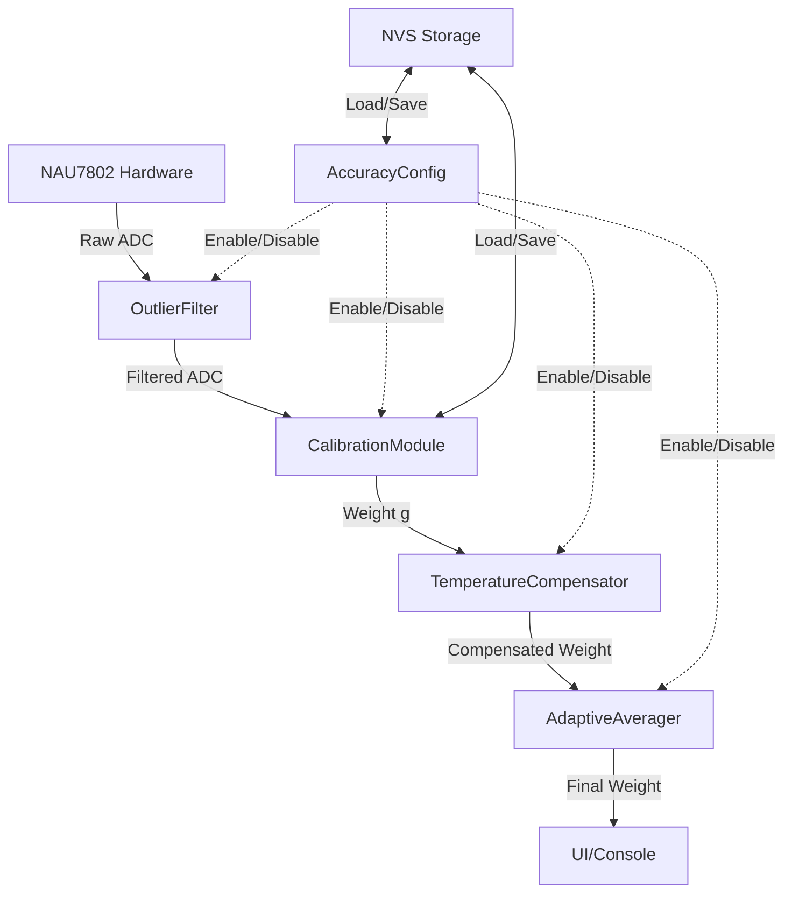
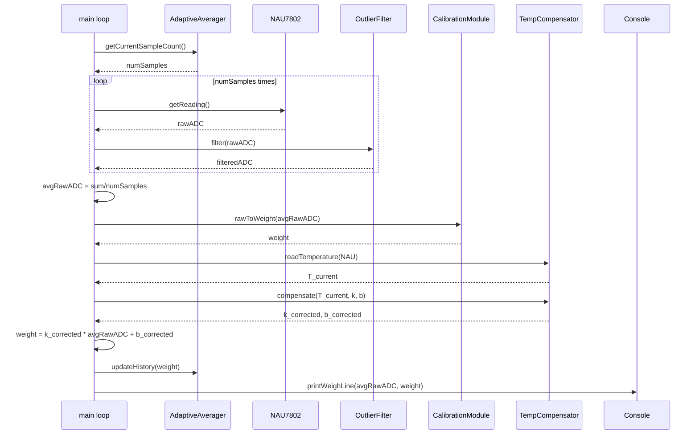

# Документ проектирования: Улучшение точности весов ESP32 + NAU7802

## Обзор

Данный документ описывает архитектуру и проектные решения для улучшения точности весов на базе ESP32 и NAU7802. Система реализует четыре независимых компонента для повышения точности измерений с текущих ±2-4 мг до субмиллиграммового уровня:

1. **Нелинейная калибровка** — устранение нелинейности тензодатчика через кусочно-линейную интерполяцию или полиномиальную регрессию
2. **Температурная компенсация** — коррекция температурного дрейфа коэффициентов калибровки
3. **Фильтрация выбросов** — отбрасывание аномальных значений от I2C ошибок и вибраций
4. **Адаптивное усреднение** — автоматический баланс между точностью и скоростью отклика

Каждый компонент может быть включён/отключён независимо для тестирования эффективности и сравнения результатов.

### Контекст

Текущая система использует:
- Линейную калибровку (y = kx + b) с 4 точками (0g, 10g, 20g, 30g)
- Фиксированное усреднение 16 отсчётов @ 80 SPS
- Точность: ±2-4 мг при 30g (тест 7 из nau7802_test_results.md)
- Проблемы: периодические I2C ошибки (Error 263), бимодальное распределение в некоторых тестах

Улучшения направлены на устранение систематических ошибок (нелинейность, температурный дрейф) и случайных ошибок (выбросы, шум).

## Архитектура

### Конвейер обработки данных

Данные проходят через последовательный конвейер компонентов:

```
Raw ADC (NAU7802)
    ↓
[Outlier Filter] ← компонент 3
    ↓
[Calibration Module] ← компонент 1
    ↓
[Temperature Compensator] ← компонент 2
    ↓
[Adaptive Averager] ← компонент 4
    ↓
Calibrated Weight (граммы)
```

Каждый компонент может быть в состоянии:
- **Enabled** — активная обработка данных
- **Bypassed** — данные проходят без изменений

### Модульная структура

```
src/
├── scale_weighing.cpp          # Главный цикл взвешивания (модифицируется)
├── scale_calibration.cpp       # Калибровка (расширяется)
├── filters/
│   ├── outlier_filter.cpp      # Компонент 3: фильтрация выбросов
│   └── adaptive_averager.cpp   # Компонент 4: адаптивное усреднение
├── calibration/
│   ├── nonlinear_calibration.cpp  # Компонент 1: нелинейная калибровка
│   └── temperature_compensation.cpp # Компонент 2: температурная компенсация
└── config/
    └── accuracy_config.cpp     # Управление конфигурацией компонентов

include/
├── filters/
│   ├── outlier_filter.h
│   └── adaptive_averager.h
├── calibration/
│   ├── nonlinear_calibration.h
│   └── temperature_compensation.h
└── config/
    └── accuracy_config.h
```

### Диаграмма компонентов



## Компоненты и интерфейсы

### 1. Модуль нелинейной калибровки (CalibrationModule)

#### Интерфейс

```cpp
// include/calibration/nonlinear_calibration.h
#pragma once
#include <stdint.h>
#include "calibration_data.h"

enum CalibrationMethod {
    CAL_LINEAR = 0,           // y = kx + b (текущий)
    CAL_PIECEWISE_LINEAR = 1, // Кусочно-линейная интерполяция
    CAL_POLYNOMIAL_2 = 2,     // Полином 2-й степени
    CAL_POLYNOMIAL_3 = 3      // Полином 3-й степени
};

struct NonlinearCalibrationData {
    CalibrationMethod method;
    
    // Для линейной и кусочно-линейной
    CalibrationPoint points[4];  // 0g, 10g, 20g, 30g
    
    // Для линейной
    float k, b;
    
    // Для полиномиальной (y = c0 + c1*x + c2*x^2 + c3*x^3)
    float coeffs[4];
    
    float r2;                    // Коэффициент детерминации
    uint32_t timestamp;
};

class CalibrationModule {
public:
    CalibrationModule();
    
    // Установить метод калибровки
    void setMethod(CalibrationMethod method);
    CalibrationMethod getMethod() const;
    
    // Калибровка (заполняет points[], вычисляет коэффициенты)
    bool calibrate(const CalibrationPoint* points, int numPoints);
    
    // Преобразование raw ADC → граммы
    float rawToWeight(int32_t rawADC) const;
    
    // Получить R²
    float getR2() const;
    
    // Загрузка/сохранение
    bool load();
    void save() const;
    
private:
    NonlinearCalibrationData data_;
    
    // Внутренние методы
    void computeLinear();
    void computePiecewiseLinear();
    void computePolynomial(int degree);
    float interpolatePiecewise(int32_t rawADC) const;
    float evaluatePolynomial(int32_t rawADC) const;
};
```

#### Алгоритмы

**Кусочно-линейная интерполяция:**

Для 4 точек (x₀, y₀), (x₁, y₁), (x₂, y₂), (x₃, y₃) создаём 3 сегмента:
- Сегмент 1: [x₀, x₁] → y = k₁(x - x₀) + y₀, где k₁ = (y₁ - y₀)/(x₁ - x₀)
- Сегмент 2: [x₁, x₂] → y = k₂(x - x₁) + y₁
- Сегмент 3: [x₂, x₃] → y = k₃(x - x₂) + y₂

Для входного x находим сегмент бинарным поиском и применяем соответствующую формулу.

**Полиномиальная регрессия:**

Для степени n решаем систему нормальных уравнений методом наименьших квадратов:
```
[Σx⁰  Σx¹  ... Σxⁿ  ] [c₀]   [Σy    ]
[Σx¹  Σx²  ... Σxⁿ⁺¹] [c₁] = [Σxy   ]
[...              ] [...]   [...]
[Σxⁿ  Σxⁿ⁺¹ ... Σx²ⁿ] [cⁿ]   [Σxⁿy  ]
```

Для n=2,3 используем прямое решение через определители (правило Крамера) или метод Гаусса.

**Вычисление R²:**

```
R² = 1 - (SS_res / SS_tot)
где:
SS_res = Σ(y_i - ŷ_i)²  // сумма квадратов остатков
SS_tot = Σ(y_i - ȳ)²    // общая сумма квадратов
ȳ = (1/n)Σy_i           // среднее значение
```

### 2. Модуль температурной компенсации (TemperatureCompensator)

#### Интерфейс

```cpp
// include/calibration/temperature_compensation.h
#pragma once
#include <stdint.h>

struct TemperatureCompensationData {
    bool enabled;
    
    float T_cal;        // Температура калибровки, °C
    float alpha;        // Температурный коэффициент для k (ppm/°C)
    float beta;         // Температурный коэффициент для b (мг/°C)
    
    // Для расширенной калибровки
    float T1, T2;       // Две температуры калибровки
    float k1, b1;       // Коэффициенты при T1
    float k2, b2;       // Коэффициенты при T2
};

class TemperatureCompensator {
public:
    TemperatureCompensator();
    
    // Включить/выключить компенсацию
    void setEnabled(bool enabled);
    bool isEnabled() const;
    
    // Установить базовую температуру и коэффициенты
    void setCalibrationTemp(float T_cal);
    void setCoefficients(float alpha, float beta);
    
    // Расширенная калибровка (вычисляет alpha, beta из двух точек)
    void calibrateTwoPoint(float T1, float k1, float b1,
                           float T2, float k2, float b2);
    
    // Применить компенсацию к коэффициентам
    void compensate(float T_current, float& k, float& b) const;
    
    // Прочитать температуру из NAU7802
    float readTemperature(NAU7802& scale) const;
    
    // Загрузка/сохранение
    bool load();
    void save() const;
    
private:
    TemperatureCompensationData data_;
};
```

#### Алгоритм компенсации

Формулы коррекции:
```
ΔT = T_current - T_cal
k_corrected = k × (1 + α × ΔT)
b_corrected = b + β × ΔT
```

Где:
- α (alpha) — относительный температурный коэффициент для наклона, ppm/°C (parts per million)
- β (beta) — абсолютный температурный коэффициент для смещения, мг/°C

Типичные значения для тензодатчиков:
- α ≈ 10-50 ppm/°C (0.00001 - 0.00005 /°C)
- β ≈ 0.1-1 мг/°C

**Вычисление α и β из двух калибровок:**

При температурах T₁ и T₂ получаем коэффициенты (k₁, b₁) и (k₂, b₂):
```
α = (k₂/k₁ - 1) / (T₂ - T₁)
β = (b₂ - b₁) / (T₂ - T₁)
```

**Чтение температуры из NAU7802:**

NAU7802 имеет встроенный температурный сенсор. Для чтения:
1. Установить регистр ADC_CTRL: TEMP_SENSOR = 1
2. Дождаться готовности данных
3. Прочитать 24-битное значение
4. Преобразовать в °C по формуле из даташита

### 3. Фильтр выбросов (OutlierFilter)

#### Интерфейс

```cpp
// include/filters/outlier_filter.h
#pragma once
#include <stdint.h>

enum OutlierFilterMethod {
    OUTLIER_NONE = 0,      // Отключён
    OUTLIER_MEDIAN = 1,    // Медианный фильтр
    OUTLIER_SIGMA = 2      // Статистический 3σ фильтр
};

struct OutlierFilterConfig {
    OutlierFilterMethod method;
    int windowSize;        // Размер окна для медианного (3, 5, 7)
    int sigmaWindow;       // Размер окна для σ вычисления (10-20)
    float sigmaThreshold;  // Порог в σ (обычно 3.0)
};

class OutlierFilter {
public:
    OutlierFilter();
    
    // Настройка метода
    void setMethod(OutlierFilterMethod method);
    void setWindowSize(int size);
    void setSigmaThreshold(float threshold);
    
    // Обработка значения
    int32_t filter(int32_t rawADC);
    
    // Статистика
    uint32_t getOutlierCount() const;
    void resetStatistics();
    
    // Загрузка/сохранение конфигурации
    bool load();
    void save() const;
    
private:
    OutlierFilterConfig config_;
    
    // Буферы для фильтров
    int32_t medianBuffer_[7];    // Максимальный размер окна
    int32_t sigmaBuffer_[20];    // Максимальный размер окна
    int bufferIndex_;
    int bufferFilled_;
    
    int32_t lastValidValue_;     // Последнее валидное значение
    uint32_t outlierCount_;      // Счётчик выбросов
    
    // Внутренние методы
    int32_t medianFilter(int32_t value);
    int32_t sigmaFilter(int32_t value);
    int32_t computeMedian(int32_t* buffer, int size);
    float computeMean(int32_t* buffer, int size);
    float computeStdDev(int32_t* buffer, int size, float mean);
};
```

#### Алгоритмы

**Медианный фильтр:**

1. Добавить новое значение в кольцевой буфер размера N (3, 5 или 7)
2. Скопировать буфер во временный массив
3. Отсортировать временный массив
4. Вернуть элемент в середине (медиану)

Преимущества: устойчив к одиночным выбросам, не требует статистики
Недостатки: задержка N/2 отсчётов, не адаптивен

**Статистический 3σ фильтр:**

1. Поддерживать скользящее окно последних N значений (10-20)
2. Вычислить среднее μ и стандартное отклонение σ
3. Если |новое_значение - μ| > 3σ:
   - Отбросить значение (выброс)
   - Вернуть последнее валидное значение
   - Инкрементировать счётчик выбросов
4. Иначе:
   - Добавить значение в окно
   - Вернуть новое значение

Формулы:
```
μ = (1/N) Σx_i
σ = sqrt((1/N) Σ(x_i - μ)²)
```

Преимущества: адаптивен к изменению уровня сигнала
Недостатки: требует заполнения окна для стабильной работы

### 4. Модуль адаптивного усреднения (AdaptiveAverager)

#### Интерфейс

```cpp
// include/filters/adaptive_averager.h
#pragma once
#include <stdint.h>

struct AdaptiveAveragerConfig {
    bool enabled;
    float stabilityThreshold;  // Порог σ для определения стабильности, мг
    int minSamples;            // Минимальное количество отсчётов (быстрый режим)
    int maxSamples;            // Максимальное количество отсчётов (точный режим)
    int transitionSteps;       // Количество шагов для плавного перехода
};

class AdaptiveAverager {
public:
    AdaptiveAverager();
    
    // Настройка
    void setEnabled(bool enabled);
    void setStabilityThreshold(float threshold);
    void setSampleRange(int minSamples, int maxSamples);
    
    // Вычислить количество отсчётов на основе стабильности
    int computeSampleCount(const float* recentWeights, int count);
    
    // Получить текущее количество отсчётов
    int getCurrentSampleCount() const;
    
    // Статистика
    float getCurrentStdDev() const;
    
    // Загрузка/сохранение
    bool load();
    void save() const;
    
private:
    AdaptiveAveragerConfig config_;
    int currentSampleCount_;
    float currentStdDev_;
    
    float computeStdDev(const float* values, int count);
};
```

#### Алгоритм

1. **Вычисление стабильности:**
   - Поддерживать буфер последних 10 измерений веса (в граммах)
   - Вычислить стандартное отклонение σ

2. **Определение количества отсчётов:**
   ```
   if σ < stabilityThreshold:
       targetSamples = maxSamples  // Стабильно → точный режим
   else:
       targetSamples = minSamples  // Нестабильно → быстрый режим
   ```

3. **Плавный переход:**
   - Не изменять currentSampleCount скачком
   - Использовать линейную интерполяцию:
     ```
     step = (targetSamples - currentSampleCount) / transitionSteps
     currentSampleCount += step
     ```
   - Это предотвращает резкие изменения показаний

4. **Интеграция с weighingTick:**
   - Вместо фиксированных 16 отсчётов использовать `currentSampleCount`
   - Обновлять `currentSampleCount` после каждого измерения

## Модели данных

### Расширенная структура CalibrationData

```cpp
// include/calibration_data.h (расширенная версия)
#pragma once
#include <stdint.h>

struct CalibrationPoint {
    int32_t rawADC;
    float weight;
};

enum CalibrationMethod {
    CAL_LINEAR = 0,
    CAL_PIECEWISE_LINEAR = 1,
    CAL_POLYNOMIAL_2 = 2,
    CAL_POLYNOMIAL_3 = 3
};

struct CalibrationData {
    // Метод калибровки
    CalibrationMethod method;
    
    // Калибровочные точки
    CalibrationPoint points[4];
    
    // Коэффициенты для линейной/кусочно-линейной
    float k, b;
    
    // Коэффициенты для полиномиальной
    float coeffs[4];  // c0, c1, c2, c3
    
    // Качество калибровки
    float r2;
    
    // Температурная компенсация
    float T_cal;      // Температура калибровки
    float alpha;      // Температурный коэффициент k
    float beta;       // Температурный коэффициент b
    
    uint32_t timestamp;
};
```

### Конфигурация компонентов

```cpp
// include/config/accuracy_config.h
#pragma once
#include <stdint.h>

struct AccuracyConfig {
    // Версия конфигурации (для совместимости)
    uint16_t version;
    
    // Флаги включения компонентов
    bool outlierFilterEnabled;
    bool temperatureCompEnabled;
    bool adaptiveAvgEnabled;
    
    // Параметры OutlierFilter
    uint8_t outlierMethod;      // OutlierFilterMethod
    uint8_t outlierWindowSize;
    float outlierSigmaThreshold;
    
    // Параметры TemperatureCompensator
    float tempAlpha;
    float tempBeta;
    
    // Параметры AdaptiveAverager
    float adaptiveStabilityThreshold;
    uint8_t adaptiveMinSamples;
    uint8_t adaptiveMaxSamples;
    
    // Контрольная сумма
    uint16_t crc16;
};

// Значения по умолчанию
constexpr AccuracyConfig DEFAULT_ACCURACY_CONFIG = {
    .version = 1,
    .outlierFilterEnabled = false,
    .temperatureCompEnabled = false,
    .adaptiveAvgEnabled = false,
    .outlierMethod = 0,  // OUTLIER_NONE
    .outlierWindowSize = 5,
    .outlierSigmaThreshold = 3.0f,
    .tempAlpha = 0.00002f,  // 20 ppm/°C
    .tempBeta = 0.5f,       // 0.5 мг/°C
    .adaptiveStabilityThreshold = 5.0f,  // 5 мг
    .adaptiveMinSamples = 10,
    .adaptiveMaxSamples = 50,
    .crc16 = 0  // Вычисляется при сохранении
};
```

### Формат хранения в NVS

Используем ESP32 NVS (Non-Volatile Storage) с namespace "scale_cfg":

| Ключ | Тип | Описание |
|------|-----|----------|
| `cal_data` | blob | CalibrationData (расширенная) |
| `acc_cfg` | blob | AccuracyConfig |
| `temp_data` | blob | TemperatureCompensationData |

Каждая структура включает CRC16 для проверки целостности.

## Тестовая стратегия

### Подход к тестированию

Данная функция представляет собой встраиваемую систему с аппаратными зависимостями (NAU7802, I2C, NVS). Property-based testing применим к чистым вычислительным компонентам, но не к интеграции с оборудованием.

**Применимость PBT:**
- ✅ Математические алгоритмы (интерполяция, регрессия, фильтры)
- ✅ Парсинг/сериализация конфигурации
- ❌ Взаимодействие с NAU7802 (аппаратная зависимость)
- ❌ Хранение в NVS (побочные эффекты)
- ❌ Калибровка (требует физических эталонов)

### Стратегия тестирования

1. **Unit-тесты с моками (PlatformIO native):**
   - Математические функции (linearRegression, computeR2, polynomial evaluation)
   - Алгоритмы фильтров (median, sigma)
   - Логика адаптивного усреднения
   - Парсинг/сериализация конфигурации

2. **Интеграционные тесты (на железе):**
   - Чтение температуры из NAU7802
   - Сохранение/загрузка из NVS
   - Полный конвейер обработки с реальными данными

3. **Тесты стабильности:**
   - 100 измерений с фиксированным весом
   - Статистика: min, max, среднее, σ
   - Сравнение с/без каждого компонента

4. **Тесты калибровки:**
   - Сравнение методов калибровки на одних и тех же точках
   - Проверка R² для каждого метода
   - Валидация температурной компенсации при разных T

### Property-Based тесты

Для математических компонентов используем property-based testing (библиотека: RapidCheck для C++ или ручная реализация генераторов).


## Correctness Properties

*A property is a characteristic or behavior that should hold true across all valid executions of a system—essentially, a formal statement about what the system should do. Properties serve as the bridge between human-readable specifications and machine-verifiable correctness guarantees.*

### Property Reflection

После анализа acceptance criteria выявлены следующие свойства для property-based testing:

**Математические алгоритмы:**
- Интерполяция (1.4): линейность между точками
- R² вычисление (1.7): диапазон [0, 1]
- Температурная компенсация (2.3): формулы коррекции, идемпотентность при ΔT=0
- Двухточечная калибровка температуры (2.5): обратимость вычисления α, β
- Медианный фильтр (3.3): корректность медианы
- Статистический фильтр (3.4, 3.5, 3.6): вычисление μ, σ, отбрасывание выбросов
- Адаптивное усреднение (4.1, 4.2, 4.3, 4.4, 4.8): вычисление σ, логика выбора количества отсчётов

**Конфигурация:**
- Bypass режим (5.4): данные проходят без изменений
- Валидация конфигурации (7.6): отклонение невалидных значений
- CRC проверка (7.7): целостность данных
- Round-trip сериализации (7.9): export → parse → export

**Устранение избыточности:**

1. Свойства 3.4, 3.5, 3.6 (статистический фильтр) можно объединить в одно комплексное свойство, так как они описывают единый алгоритм фильтрации.

2. Свойства 4.2 и 4.3 (выбор количества отсчётов) — это две стороны одной логики, можно объединить в одно свойство с условием.

3. Свойство 4.1 (вычисление σ) уже покрывается свойством 3.4 (вычисление σ для фильтра), так как формула одинаковая.

После устранения избыточности остаётся 12 уникальных свойств.

### Property 1: Кусочно-линейная интерполяция сохраняет линейность в сегментах

*For any* набор из 4 упорядоченных калибровочных точек (x₀, y₀), (x₁, y₁), (x₂, y₂), (x₃, y₃) где x₀ < x₁ < x₂ < x₃, и для любого значения x в диапазоне [xᵢ, xᵢ₊₁], результат интерполяции должен находиться в диапазоне [yᵢ, yᵢ₊₁] (или [yᵢ₊₁, yᵢ] если yᵢ₊₁ < yᵢ), и должен быть линейной функцией x.

**Validates: Requirements 1.4**

### Property 2: R² находится в допустимом диапазоне

*For any* набор калибровочных точек и любой метод калибровки (линейная, кусочно-линейная, полиномиальная), вычисленный коэффициент детерминации R² должен находиться в диапазоне [0, 1].

**Validates: Requirements 1.7**

### Property 3: Температурная компенсация идемпотентна при нулевой разнице температур

*For any* коэффициентов калибровки k и b, температурных коэффициентов α и β, и температуры T_cal, если текущая температура T_current = T_cal (ΔT = 0), то применение температурной компенсации должно вернуть исходные коэффициенты: k_corrected = k, b_corrected = b.

**Validates: Requirements 2.3**

### Property 4: Температурная компенсация следует линейным формулам

*For any* коэффициентов k, b, температурных коэффициентов α, β, базовой температуры T_cal и текущей температуры T_current, скорректированные коэффициенты должны удовлетворять формулам:
- k_corrected = k × (1 + α × (T_current - T_cal))
- b_corrected = b + β × (T_current - T_cal)

**Validates: Requirements 2.3**

### Property 5: Двухточечная температурная калибровка обратима

*For any* двух температур T₁ и T₂ (T₁ ≠ T₂) и соответствующих коэффициентов (k₁, b₁) и (k₂, b₂), если вычислить температурные коэффициенты α и β по формулам:
- α = (k₂/k₁ - 1) / (T₂ - T₁)
- β = (b₂ - b₁) / (T₂ - T₁)

то применение этих коэффициентов для компенсации от T₁ к T₂ должно вернуть исходные коэффициенты (k₂, b₂) с точностью до погрешности вычислений с плавающей точкой.

**Validates: Requirements 2.5**

### Property 6: Медианный фильтр возвращает медиану окна

*For any* последовательности значений и размера окна N ∈ {3, 5, 7}, после заполнения окна N значениями, результат медианного фильтра должен быть равен медиане этих N значений (элемент в середине отсортированного массива).

**Validates: Requirements 3.3**

### Property 7: Статистический фильтр корректно обрабатывает выбросы

*For any* последовательности значений с нормальным распределением (μ, σ) и порогом k (обычно 3), если добавить значение x такое что |x - μ| > k×σ, то статистический фильтр должен:
1. Отбросить это значение (не добавлять в окно)
2. Вернуть последнее валидное значение
3. Инкрементировать счётчик выбросов на 1

**Validates: Requirements 3.4, 3.5, 3.6**

### Property 8: Адаптивное усреднение выбирает количество отсчётов на основе стабильности

*For any* последовательности из 10 измерений веса с вычисленным стандартным отклонением σ и порогом стабильности threshold:
- Если σ < threshold, то computeSampleCount() должен вернуть значение близкое к maxSamples
- Если σ ≥ threshold, то computeSampleCount() должен вернуть значение близкое к minSamples

(с учётом плавного перехода через transitionSteps)

**Validates: Requirements 4.2, 4.3**

### Property 9: Адаптивное усреднение изменяется плавно

*For any* последовательности вызовов computeSampleCount() с изменяющимся σ, изменение currentSampleCount между двумя последовательными вызовами не должно превышать максимального шага: |currentSampleCount[i+1] - currentSampleCount[i]| ≤ (maxSamples - minSamples) / transitionSteps.

**Validates: Requirements 4.4**

### Property 10: Адаптивное усреднение быстро реагирует на резкие изменения

*For any* последовательности измерений, где σ резко возрастает (переход от σ < threshold к σ ≥ 2×threshold), переход от текущего количества отсчётов к minSamples должен произойти не более чем за 2 вызова computeSampleCount().

**Validates: Requirements 4.8**

### Property 11: Bypass режим не изменяет данные

*For any* входного значения (raw ADC или weight) и любого компонента (OutlierFilter, CalibrationModule, TemperatureCompensator, AdaptiveAverager), если компонент находится в режиме bypass (отключён), то выходное значение должно быть равно входному.

**Validates: Requirements 5.4**

### Property 12: Валидация конфигурации отклоняет невалидные значения

*For any* конфигурации AccuracyConfig, где хотя бы один параметр находится вне допустимого диапазона (например, outlierWindowSize ∉ {3, 5, 7}, или adaptiveMinSamples > adaptiveMaxSamples, или отрицательные значения), функция валидации должна вернуть false и отклонить импорт.

**Validates: Requirements 7.6**

### Property 13: CRC обнаруживает повреждение данных

*For any* валидной конфигурации AccuracyConfig с вычисленной контрольной суммой CRC16, если изменить любой байт в сериализованных данных (кроме самого поля CRC), то проверка CRC должна вернуть false.

**Validates: Requirements 7.7**

### Property 14: Round-trip сериализации конфигурации

*For any* валидной конфигурации AccuracyConfig, последовательность операций export → parse → export должна вернуть текстовое представление, эквивалентное исходному (с точностью до форматирования пробелов и порядка полей, если используется JSON).

**Validates: Requirements 7.9**

## Обработка ошибок

### Стратегия обработки ошибок

Система использует многоуровневую стратегию обработки ошибок:

1. **Аппаратные ошибки (NAU7802, I2C):**
   - Повторные попытки чтения (до 3 раз)
   - Fallback на последнее валидное значение
   - Логирование ошибок с кодами
   - Продолжение работы в деградированном режиме

2. **Ошибки калибровки:**
   - Проверка R² < 0.99 → предупреждение, повтор калибровки
   - Проверка монотонности точек (x₀ < x₁ < x₂ < x₃)
   - Отклонение калибровки при невалидных данных

3. **Ошибки конфигурации:**
   - Проверка CRC при загрузке из NVS
   - Валидация диапазонов параметров
   - Fallback на DEFAULT_ACCURACY_CONFIG при ошибках
   - Предупреждение пользователю

4. **Ошибки фильтрации:**
   - Outlier filter: при недостаточном заполнении окна возвращать raw значение
   - Adaptive averager: при недостаточной истории использовать minSamples

### Коды ошибок

```cpp
enum ErrorCode {
    ERR_NONE = 0,
    ERR_I2C_TIMEOUT = 1,
    ERR_I2C_NACK = 2,
    ERR_NAU7802_NOT_READY = 3,
    ERR_TEMP_SENSOR_FAIL = 4,
    ERR_CALIBRATION_LOW_R2 = 5,
    ERR_CALIBRATION_INVALID_POINTS = 6,
    ERR_NVS_READ_FAIL = 7,
    ERR_NVS_WRITE_FAIL = 8,
    ERR_CONFIG_CRC_MISMATCH = 9,
    ERR_CONFIG_INVALID_PARAMS = 10
};
```

### Логирование ошибок

Все ошибки логируются через `printTagged()` с тегом "ERROR" и кодом ошибки:
```cpp
printTagged("ERROR", "I2C timeout (code 1), retrying...");
```

Критические ошибки (невозможность инициализации NAU7802) приводят к остановке системы с выводом сообщения.

## Тестовая стратегия

### Применимость Property-Based Testing

Данная функция включает как чистые вычислительные компоненты (подходят для PBT), так и интеграцию с аппаратурой (не подходят для PBT).

**PBT применим к:**
- ✅ Математическим алгоритмам (интерполяция, регрессия, статистика)
- ✅ Фильтрам (median, sigma)
- ✅ Логике адаптивного усреднения
- ✅ Сериализации/парсингу конфигурации

**PBT НЕ применим к:**
- ❌ Взаимодействию с NAU7802 (аппаратная зависимость)
- ❌ Хранению в NVS (побочные эффекты, внешнее хранилище)
- ❌ Консольным командам (UI, интеграция)
- ❌ Полному конвейеру на железе (требует физических эталонов)

### Тестовые уровни

#### 1. Unit-тесты с Property-Based Testing (PlatformIO native)

Используем библиотеку для PBT в C++ (например, RapidCheck или ручные генераторы).

**Минимум 100 итераций на свойство.**

Каждый тест помечается комментарием:
```cpp
// Feature: scale-accuracy-improvements, Property 1: Кусочно-линейная интерполяция сохраняет линейность в сегментах
TEST_CASE("Piecewise linear interpolation preserves linearity") {
    // 100+ iterations with random calibration points
}
```

**Тестируемые компоненты:**
- `CalibrationModule`: свойства 1, 2
- `TemperatureCompensator`: свойства 3, 4, 5
- `OutlierFilter`: свойства 6, 7
- `AdaptiveAverager`: свойства 8, 9, 10
- `AccuracyConfig`: свойства 11, 12, 13, 14

**Генераторы данных:**
- Случайные калибровочные точки (упорядоченные, в диапазоне 0-30g)
- Случайные температуры (-10°C до +50°C)
- Случайные последовательности ADC значений (с/без выбросов)
- Случайные конфигурации (валидные и невалидные)

#### 2. Unit-тесты с примерами

Для проверки конкретных сценариев и граничных случаев:
- Поддержка трёх методов калибровки (линейная, кусочно-линейная, полиномиальная)
- Поддержка трёх размеров окна медианного фильтра (3, 5, 7)
- Bypass режимы для каждого компонента
- Обработка ошибок (повреждённая конфигурация, недоступный сенсор)
- Обратная совместимость со старым форматом CalibrationData

#### 3. Интеграционные тесты (на железе ESP32)

Тесты с реальным NAU7802 и NVS:
- Чтение температуры из NAU7802
- Сохранение/загрузка конфигурации из NVS
- Полный конвейер обработки: Raw ADC → Outlier Filter → Calibration → Temp Comp → Adaptive Avg
- Калибровка с физическими эталонами (0g, 10g, 20g, 30g)
- Температурная калибровка при двух температурах (требует термокамеры или естественного изменения T)

#### 4. Тесты стабильности

Длительные тесты на железе:
- 100 измерений с фиксированным весом 30g
- Статистика: min, max, среднее, σ
- Сравнение с/без каждого компонента
- Цель: σ < 2 мг при 30g (улучшение с текущих ±2-4 мг)

#### 5. Сравнительные тесты

Тесты для оценки эффективности улучшений:
- Сравнение методов калибровки (линейная vs кусочно-линейная vs полиномиальная)
- Сравнение с/без температурной компенсации при изменении T на ±10°C
- Сравнение с/без фильтрации выбросов при наличии I2C ошибок
- Сравнение с/без адаптивного усреднения при изменении веса

### Конфигурация Property-Based тестов

```cpp
// test/test_calibration.cpp
#include <unity.h>
#include "calibration/nonlinear_calibration.h"

// Feature: scale-accuracy-improvements, Property 1: Кусочно-линейная интерполяция сохраняет линейность в сегментах
void test_piecewise_linear_interpolation_linearity() {
    for (int iter = 0; iter < 100; iter++) {
        // Generate random calibration points
        CalibrationPoint points[4];
        // ... generate ordered points ...
        
        CalibrationModule cal;
        cal.setMethod(CAL_PIECEWISE_LINEAR);
        cal.calibrate(points, 4);
        
        // Test interpolation in each segment
        for (int seg = 0; seg < 3; seg++) {
            int32_t x0 = points[seg].rawADC;
            int32_t x1 = points[seg+1].rawADC;
            float y0 = points[seg].weight;
            float y1 = points[seg+1].weight;
            
            // Test random point in segment
            int32_t x = x0 + rand() % (x1 - x0);
            float y = cal.rawToWeight(x);
            
            // Check y is in range [min(y0,y1), max(y0,y1)]
            float yMin = (y0 < y1) ? y0 : y1;
            float yMax = (y0 < y1) ? y1 : y0;
            TEST_ASSERT_TRUE(y >= yMin && y <= yMax);
            
            // Check linearity: y = y0 + (y1-y0)/(x1-x0) * (x-x0)
            float expected = y0 + (y1 - y0) / (x1 - x0) * (x - x0);
            TEST_ASSERT_FLOAT_WITHIN(0.001, expected, y);
        }
    }
}

void setUp() {}
void tearDown() {}

int main() {
    UNITY_BEGIN();
    RUN_TEST(test_piecewise_linear_interpolation_linearity);
    // ... other property tests ...
    UNITY_END();
    return 0;
}
```

### Метрики успеха

1. **Покрытие кода:** ≥ 80% для всех новых модулей
2. **Property-based тесты:** Все 14 свойств реализованы, минимум 100 итераций каждое
3. **Стабильность:** σ < 2 мг при 30g (улучшение с ±2-4 мг)
4. **Точность калибровки:** R² ≥ 0.99 для всех методов
5. **Обнаружение выбросов:** ≥ 95% выбросов отфильтровано (при искусственном добавлении)
6. **Температурная компенсация:** Дрейф < 1 мг при ΔT = ±10°C
7. **Скорость отклика:** Переход на minSamples за ≤ 2 измерения при резком изменении веса


## API дизайн

### Публичный API для управления компонентами

```cpp
// include/config/accuracy_config.h

class AccuracyConfigManager {
public:
    // Инициализация (загрузка из NVS или дефолт)
    void init();
    
    // Управление компонентами
    void enableOutlierFilter(bool enable);
    void enableTemperatureComp(bool enable);
    void enableAdaptiveAveraging(bool enable);
    
    bool isOutlierFilterEnabled() const;
    bool isTemperatureCompEnabled() const;
    bool isAdaptiveAveragingEnabled() const;
    
    // Настройка параметров
    void setOutlierMethod(OutlierFilterMethod method);
    void setOutlierWindowSize(int size);
    void setOutlierSigmaThreshold(float threshold);
    
    void setTempCoefficients(float alpha, float beta);
    
    void setAdaptiveParams(float stabilityThreshold, 
                          int minSamples, 
                          int maxSamples);
    
    // Сохранение/загрузка
    bool save();
    bool load();
    
    // Сброс к дефолту
    void reset();
    
    // Экспорт/импорт конфигурации
    String exportConfig() const;  // JSON или key=value
    bool importConfig(const String& configText);
    
    // Статус
    void printStatus() const;
    
private:
    AccuracyConfig config_;
    bool validateConfig(const AccuracyConfig& cfg) const;
    uint16_t computeCRC16(const AccuracyConfig& cfg) const;
};
```

### Интеграция с существующим кодом

#### Модификация scale_weighing.cpp

```cpp
// src/scale_weighing.cpp (модифицированная версия)
#include "scale_weighing.h"
#include "filters/outlier_filter.h"
#include "calibration/nonlinear_calibration.h"
#include "calibration/temperature_compensation.h"
#include "filters/adaptive_averager.h"
#include "config/accuracy_config.h"
#include "ui_console.h"

// Глобальные экземпляры компонентов
static OutlierFilter g_outlierFilter;
static CalibrationModule g_calibration;
static TemperatureCompensator g_tempComp;
static AdaptiveAverager g_adaptiveAvg;
static AccuracyConfigManager g_config;

// Инициализация компонентов (вызывается из setup())
void initAccuracyComponents() {
    g_config.init();
    g_outlierFilter.load();
    g_calibration.load();
    g_tempComp.load();
    g_adaptiveAvg.load();
}

// Модифицированный цикл взвешивания
void weighingTick(NAU7802& scale) {
    // 1. Определить количество отсчётов (адаптивное усреднение)
    int numSamples = 16;  // дефолт
    if (g_config.isAdaptiveAveragingEnabled()) {
        // Используем историю последних измерений для определения σ
        numSamples = g_adaptiveAvg.getCurrentSampleCount();
    }
    
    // 2. Собрать отсчёты с фильтрацией выбросов
    int64_t sum = 0;
    int validSamples = 0;
    
    for (int i = 0; i < numSamples; i++) {
        while (!scale.available()) {
            delay(1);
        }
        int32_t rawADC = scale.getReading();
        
        // Применить фильтр выбросов
        if (g_config.isOutlierFilterEnabled()) {
            rawADC = g_outlierFilter.filter(rawADC);
        }
        
        sum += rawADC;
        validSamples++;
    }
    
    int32_t avgRawADC = (int32_t)(sum / validSamples);
    
    // 3. Применить калибровку (нелинейную если настроено)
    float weight = g_calibration.rawToWeight(avgRawADC);
    
    // 4. Применить температурную компенсацию
    if (g_config.isTemperatureCompEnabled()) {
        float T_current = g_tempComp.readTemperature(scale);
        // Компенсация применяется внутри CalibrationModule
        // через коррекцию коэффициентов k, b
        float k = g_calibration.getK();
        float b = g_calibration.getB();
        g_tempComp.compensate(T_current, k, b);
        weight = k * avgRawADC + b;
    }
    
    // 5. Обновить адаптивное усреднение (для следующего измерения)
    if (g_config.isAdaptiveAveragingEnabled()) {
        // Добавить текущий вес в историю для вычисления σ
        g_adaptiveAvg.updateHistory(weight);
    }
    
    // 6. Вывод
    printWeighLine(avgRawADC, weight);
}

// Доступ к компонентам для консольных команд
AccuracyConfigManager& getAccuracyConfig() { return g_config; }
OutlierFilter& getOutlierFilter() { return g_outlierFilter; }
CalibrationModule& getCalibration() { return g_calibration; }
TemperatureCompensator& getTempCompensator() { return g_tempComp; }
AdaptiveAverager& getAdaptiveAverager() { return g_adaptiveAvg; }
```

#### Расширение консольных команд (ui_console.cpp)

```cpp
// Новые команды для управления компонентами

// Команда: accuracy status
void cmd_accuracy_status() {
    AccuracyConfigManager& cfg = getAccuracyConfig();
    cfg.printStatus();
    
    printTagged("OUTLIER", String("Outliers rejected: ") + 
                getOutlierFilter().getOutlierCount());
    printTagged("ADAPTIVE", String("Current samples: ") + 
                getAdaptiveAverager().getCurrentSampleCount());
    printTagged("ADAPTIVE", String("Current σ: ") + 
                getAdaptiveAverager().getCurrentStdDev());
}

// Команда: accuracy enable <component>
void cmd_accuracy_enable(const String& component) {
    AccuracyConfigManager& cfg = getAccuracyConfig();
    
    if (component == "outlier") {
        cfg.enableOutlierFilter(true);
        printTagged("CONFIG", "Outlier filter enabled");
    } else if (component == "temp") {
        cfg.enableTemperatureComp(true);
        printTagged("CONFIG", "Temperature compensation enabled");
    } else if (component == "adaptive") {
        cfg.enableAdaptiveAveraging(true);
        printTagged("CONFIG", "Adaptive averaging enabled");
    } else {
        printTagged("ERROR", "Unknown component: " + component);
        return;
    }
    
    cfg.save();
}

// Команда: accuracy disable <component>
void cmd_accuracy_disable(const String& component) {
    // Аналогично enable, но с false
}

// Команда: accuracy set outlier_method <median|sigma>
void cmd_accuracy_set_outlier_method(const String& method) {
    AccuracyConfigManager& cfg = getAccuracyConfig();
    
    if (method == "median") {
        cfg.setOutlierMethod(OUTLIER_MEDIAN);
    } else if (method == "sigma") {
        cfg.setOutlierMethod(OUTLIER_SIGMA);
    } else {
        printTagged("ERROR", "Unknown method: " + method);
        return;
    }
    
    cfg.save();
    printTagged("CONFIG", "Outlier method set to " + method);
}

// Команда: accuracy set outlier_window <3|5|7>
void cmd_accuracy_set_outlier_window(int size) {
    if (size != 3 && size != 5 && size != 7) {
        printTagged("ERROR", "Window size must be 3, 5, or 7");
        return;
    }
    
    AccuracyConfigManager& cfg = getAccuracyConfig();
    cfg.setOutlierWindowSize(size);
    cfg.save();
    printTagged("CONFIG", String("Outlier window size set to ") + size);
}

// Команда: accuracy set temp_alpha <value>
void cmd_accuracy_set_temp_alpha(float alpha) {
    AccuracyConfigManager& cfg = getAccuracyConfig();
    float beta = cfg.getTempBeta();  // сохранить текущий beta
    cfg.setTempCoefficients(alpha, beta);
    cfg.save();
    printTagged("CONFIG", String("Temperature alpha set to ") + alpha);
}

// Команда: accuracy set adaptive_threshold <value>
void cmd_accuracy_set_adaptive_threshold(float threshold) {
    AccuracyConfigManager& cfg = getAccuracyConfig();
    cfg.setAdaptiveParams(threshold, 
                         cfg.getAdaptiveMinSamples(),
                         cfg.getAdaptiveMaxSamples());
    cfg.save();
    printTagged("CONFIG", String("Adaptive threshold set to ") + threshold);
}

// Команда: accuracy export
void cmd_accuracy_export() {
    AccuracyConfigManager& cfg = getAccuracyConfig();
    String configText = cfg.exportConfig();
    Serial.println("=== Configuration Export ===");
    Serial.println(configText);
    Serial.println("=== End ===");
}

// Команда: accuracy import
void cmd_accuracy_import() {
    printTagged("CONFIG", "Paste configuration and press Ctrl+D:");
    
    String configText = "";
    while (true) {
        if (Serial.available()) {
            char c = Serial.read();
            if (c == 4) break;  // Ctrl+D
            configText += c;
        }
        delay(10);
    }
    
    AccuracyConfigManager& cfg = getAccuracyConfig();
    if (cfg.importConfig(configText)) {
        cfg.save();
        printTagged("CONFIG", "Configuration imported successfully");
    } else {
        printTagged("ERROR", "Failed to import configuration");
    }
}

// Команда: accuracy reset
void cmd_accuracy_reset() {
    AccuracyConfigManager& cfg = getAccuracyConfig();
    cfg.reset();
    cfg.save();
    printTagged("CONFIG", "Configuration reset to defaults");
}

// Команда: accuracy test stability
void cmd_accuracy_test_stability() {
    printTagged("TEST", "Running stability test (100 measurements)...");
    
    const int numMeasurements = 100;
    float measurements[numMeasurements];
    
    for (int i = 0; i < numMeasurements; i++) {
        // Выполнить одно измерение
        // ... (код измерения) ...
        measurements[i] = weight;
        
        if (i % 10 == 0) {
            printTagged("TEST", String("Progress: ") + i + "/100");
        }
    }
    
    // Вычислить статистику
    float min = measurements[0];
    float max = measurements[0];
    float sum = 0;
    
    for (int i = 0; i < numMeasurements; i++) {
        if (measurements[i] < min) min = measurements[i];
        if (measurements[i] > max) max = measurements[i];
        sum += measurements[i];
    }
    
    float mean = sum / numMeasurements;
    
    float variance = 0;
    for (int i = 0; i < numMeasurements; i++) {
        float diff = measurements[i] - mean;
        variance += diff * diff;
    }
    float stddev = sqrt(variance / numMeasurements);
    
    // Вывод результатов
    printTagged("TEST", "=== Stability Test Results ===");
    printTagged("TEST", String("Min: ") + min + " g");
    printTagged("TEST", String("Max: ") + max + " g");
    printTagged("TEST", String("Mean: ") + mean + " g");
    printTagged("TEST", String("StdDev: ") + stddev + " g");
    printTagged("TEST", String("Range: ±") + ((max - min) / 2) + " g");
}

// Команда: accuracy compare calibration
void cmd_accuracy_compare_calibration() {
    printTagged("TEST", "Comparing calibration methods...");
    
    CalibrationModule& cal = getCalibration();
    
    // Сохранить текущий метод
    CalibrationMethod originalMethod = cal.getMethod();
    
    // Выполнить измерение каждым методом
    int32_t rawADC = collectSamples(scale, 50);
    
    cal.setMethod(CAL_LINEAR);
    float weightLinear = cal.rawToWeight(rawADC);
    
    cal.setMethod(CAL_PIECEWISE_LINEAR);
    float weightPiecewise = cal.rawToWeight(rawADC);
    
    cal.setMethod(CAL_POLYNOMIAL_2);
    float weightPoly2 = cal.rawToWeight(rawADC);
    
    cal.setMethod(CAL_POLYNOMIAL_3);
    float weightPoly3 = cal.rawToWeight(rawADC);
    
    // Восстановить исходный метод
    cal.setMethod(originalMethod);
    
    // Вывод результатов
    printTagged("TEST", "=== Calibration Method Comparison ===");
    printTagged("TEST", String("Linear: ") + weightLinear + " g");
    printTagged("TEST", String("Piecewise Linear: ") + weightPiecewise + " g");
    printTagged("TEST", String("Polynomial (degree 2): ") + weightPoly2 + " g");
    printTagged("TEST", String("Polynomial (degree 3): ") + weightPoly3 + " g");
}
```

### Диаграмма последовательности измерения



## Интеграция с существующим кодом

### Изменения в существующих файлах

#### 1. include/calibration_data.h

Расширить структуру `CalibrationData` для поддержки нелинейной калибровки и температурной компенсации:

```cpp
// Добавить в конец структуры CalibrationData:
    CalibrationMethod method;  // Новое поле
    float coeffs[4];           // Для полиномиальной калибровки
    float T_cal;               // Температура калибровки
    float alpha;               // Температурный коэффициент k
    float beta;                // Температурный коэффициент b
```

Обеспечить обратную совместимость: при загрузке старой структуры (без новых полей) установить `method = CAL_LINEAR`, `coeffs = {0}`, `T_cal = 25.0`, `alpha = 0.00002`, `beta = 0.5`.

#### 2. src/scale_calibration.cpp

Модифицировать `runCalibrationWizard()` для поддержки выбора метода калибровки:

```cpp
bool runCalibrationWizard(NAU7802& scale, CalibrationData& cal, 
                         CalibrationMethod method = CAL_LINEAR) {
    // ... существующий код сбора точек ...
    
    // Вычислить коэффициенты в зависимости от метода
    switch (method) {
        case CAL_LINEAR:
            linearRegression(cal.points, 4, cal.k, cal.b);
            break;
        case CAL_PIECEWISE_LINEAR:
            // Коэффициенты вычисляются при интерполяции
            cal.k = 0;  // не используется
            cal.b = 0;
            break;
        case CAL_POLYNOMIAL_2:
        case CAL_POLYNOMIAL_3:
            polynomialRegression(cal.points, 4, 
                               method == CAL_POLYNOMIAL_2 ? 2 : 3,
                               cal.coeffs);
            break;
    }
    
    cal.method = method;
    cal.r2 = computeR2(cal.points, 4, cal);
    
    // ... остальной код ...
}
```

#### 3. src/scale_weighing.cpp

Заменить простое вычисление `computeWeight()` на вызов `CalibrationModule::rawToWeight()`, который учитывает выбранный метод калибровки.

#### 4. src/main.cpp

Добавить инициализацию компонентов в `setup()`:

```cpp
void setup() {
    // ... существующий код инициализации NAU7802 ...
    
    // Инициализация компонентов точности
    initAccuracyComponents();
    
    printTagged("INIT", "Accuracy components initialized");
}
```

### Миграция данных

При первом запуске с новой прошивкой:

1. Загрузить старую структуру `CalibrationData` из NVS
2. Если загрузка успешна:
   - Установить `method = CAL_LINEAR`
   - Установить дефолтные значения для новых полей
   - Сохранить расширенную структуру обратно в NVS
3. Если загрузка неуспешна:
   - Использовать полностью дефолтную конфигурацию
   - Предложить пользователю выполнить калибровку

## Диагностика и отладка

### Режим диагностики

Включается командой `accuracy diag on`:

```cpp
void enableDiagnosticMode(bool enable) {
    g_diagnosticMode = enable;
}

void weighingTick_diagnostic(NAU7802& scale) {
    // Вывод промежуточных значений на каждом этапе
    
    int32_t rawADC = scale.getReading();
    Serial.print("Raw ADC: ");
    Serial.println(rawADC);
    
    int32_t filtered = g_outlierFilter.filter(rawADC);
    Serial.print("After Outlier Filter: ");
    Serial.println(filtered);
    
    float weight = g_calibration.rawToWeight(filtered);
    Serial.print("After Calibration: ");
    Serial.println(weight);
    
    float T = g_tempComp.readTemperature(scale);
    Serial.print("Temperature: ");
    Serial.println(T);
    
    float k = g_calibration.getK();
    float b = g_calibration.getB();
    g_tempComp.compensate(T, k, b);
    float compensated = k * filtered + b;
    Serial.print("After Temp Compensation: ");
    Serial.println(compensated);
    
    Serial.print("Final Weight: ");
    Serial.println(compensated);
    Serial.println("---");
}
```

### Лог измерений

Кольцевой буфер последних 100 измерений в RAM:

```cpp
struct MeasurementLog {
    uint32_t timestamp;
    int32_t rawADC;
    int32_t filteredADC;
    float weight;
    float temperature;
    bool outlierRejected;
};

class MeasurementLogger {
public:
    void log(const MeasurementLog& entry);
    void exportCSV() const;
    void clear();
    
private:
    MeasurementLog buffer_[100];
    int index_;
};
```

Экспорт в CSV:
```
timestamp,rawADC,filteredADC,weight,temperature,outlierRejected
1234,1185000,1185000,29.987,24.5,0
1456,1185100,1185100,29.989,24.5,0
1678,1195000,1185100,29.989,24.5,1
...
```

### Команды диагностики

```
accuracy diag on              # Включить режим диагностики
accuracy diag off             # Выключить режим диагностики
accuracy log export           # Экспортировать лог в CSV
accuracy log clear            # Очистить лог
accuracy stats                # Вывести статистику (uptime, измерений, выбросов)
```

## Производительность и ресурсы

### Использование памяти

| Компонент | RAM (байт) | Flash (байт) |
|-----------|------------|--------------|
| OutlierFilter | ~100 (буферы) | ~2 KB |
| CalibrationModule | ~200 (данные) | ~3 KB |
| TemperatureCompensator | ~50 | ~1 KB |
| AdaptiveAverager | ~100 (история) | ~1 KB |
| AccuracyConfig | ~100 | ~2 KB |
| MeasurementLogger | ~2400 (100 записей) | ~1 KB |
| **Итого** | **~3 KB** | **~10 KB** |

ESP32 имеет 520 KB RAM и 4 MB Flash, так что ресурсов достаточно.

### Время выполнения

| Операция | Время (мс) |
|----------|------------|
| Чтение ADC (1 отсчёт) | ~12.5 (80 SPS) |
| Медианный фильтр (окно 5) | <0.1 |
| Статистический фильтр | <0.2 |
| Кусочно-линейная интерполяция | <0.1 |
| Полиномиальная регрессия (степень 3) | <0.5 |
| Чтение температуры NAU7802 | ~50 |
| Температурная компенсация | <0.1 |
| **Полный цикл (16 отсчётов)** | **~200-250 мс** |

Скорость вывода: ~4-5 измерений/сек (без изменений относительно текущей системы).

### Оптимизации

1. **Кэширование температуры:** Читать температуру не каждое измерение, а раз в 10 секунд (температура меняется медленно)
2. **Ленивое вычисление σ:** Вычислять стандартное отклонение для адаптивного усреднения только когда буфер обновился
3. **Inline функции:** Использовать `inline` для простых математических функций
4. **Фиксированная точка:** Для критичных по производительности операций можно использовать fixed-point арифметику вместо float

## Безопасность и надёжность

### Защита от некорректных данных

1. **Валидация калибровочных точек:**
   - Проверка монотонности: x₀ < x₁ < x₂ < x₃
   - Проверка диапазона: 0 ≤ weight ≤ 50g
   - Проверка R² ≥ 0.99

2. **Валидация конфигурации:**
   - Проверка диапазонов всех параметров
   - Проверка CRC при загрузке из NVS
   - Fallback на дефолт при ошибках

3. **Защита от переполнения:**
   - Использование `int64_t` для суммирования ADC значений
   - Проверка деления на ноль в формулах

### Обработка сбоев

1. **I2C ошибки:**
   - Повторные попытки (до 3 раз)
   - Fallback на последнее валидное значение
   - Логирование ошибок

2. **Сбой NVS:**
   - Использование дефолтной конфигурации
   - Предупреждение пользователю
   - Возможность ручной настройки через консоль

3. **Сбой температурного сенсора:**
   - Отключение температурной компенсации
   - Использование некомпенсированных коэффициентов
   - Предупреждение в логе

## Будущие улучшения

1. **Калман-фильтр:** Более продвинутая фильтрация с моделью динамики системы
2. **Машинное обучение:** Обучение модели нелинейности на большом наборе данных
3. **Автокалибровка:** Периодическая проверка и коррекция калибровки по известным эталонам
4. **Веб-интерфейс:** Настройка и мониторинг через WiFi
5. **Логирование на SD-карту:** Долговременное хранение измерений для анализа
6. **Компенсация влажности:** Учёт влияния влажности воздуха на тензодатчик

